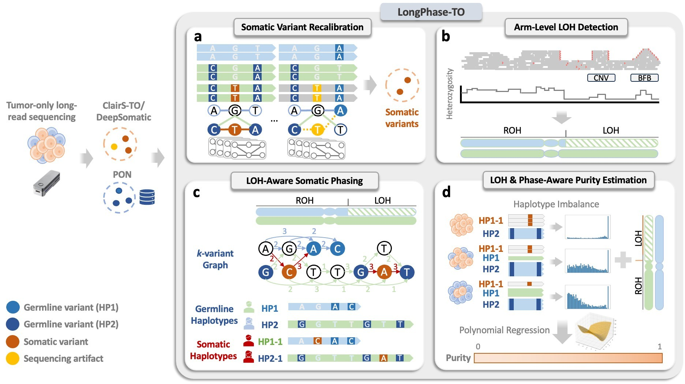
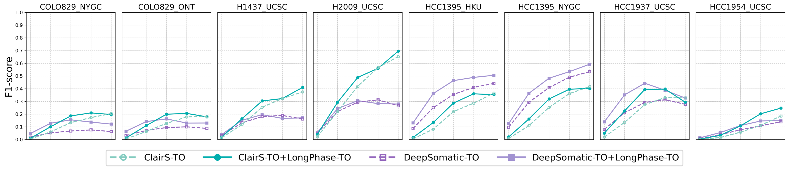
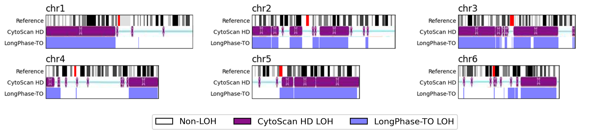
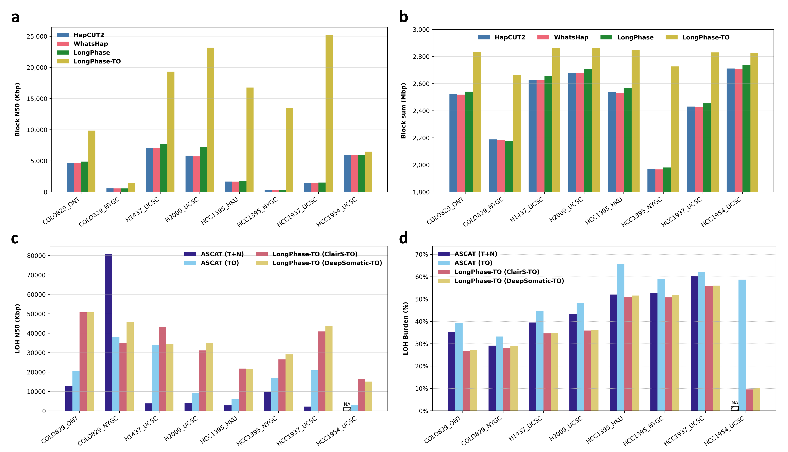
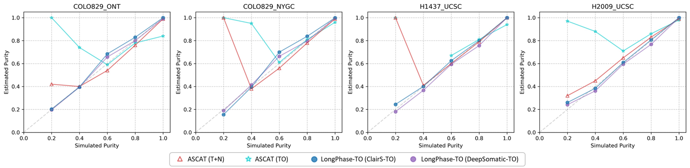
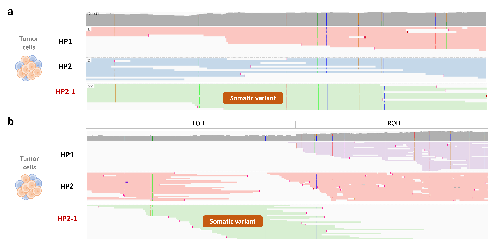

# LongPhase-TO
**LongPhase-TO** is a tumor-only variant phasing and analysis pipeline that extends [**LongPhase**](https://github.com/twolinin/longphase) for ONT long-read sequencing data.  

<!-- It supports:
- **LOH (Loss of Heterozygosity) Detection**
  
- **Somatic Variant Calling**
  
- **Joint Phasing of Germline and Somatic Variants**
  
- **Tumor Purity Estimation**
  
- **Haplotagging**
  


LongPhase-TO Overview:
 -->

## Performance
- **Somatic Variant Recalibration**
  - snv
  
  <!-- - snp (indel co-phasing)
   -->
  - indel
  
- **Arm-Level LOH (Loss of Heterozygosity) Detection**
  
- **LOH-Aware Somatic Phasing**
  
- **LOH & Phase-Aware Purity Estimation**
  
- **Haplotagging**
  

---
[LongPhase-TO](#longphase-to)
- [Performance](#performance)
- [Installation](#installation)
- [Usage](#usage)
  - [Phase command](#phase-command)
    - [SNP only phasing](./docs/phase.md#snp-only-phasing)
    - [Complete list of Phase parameters](./docs/phase.md#complete-list-of-phase-parameters)
    - [Phased Genotype Output Format](./docs/phase.md#phased-genotype-output-format)
    - [Haplotype-aware Variant Re-calling Output Format](./docs/phase.md#haplotype-aware-variant-re-calling-output-format)
    - [Output files of Purity](./docs/phase.md#output-files-of-Purity)
  - [Haplotag command](#haplotag-command)
    - [Complete list of Haplotag parameters](./docs/haplotag.md#complete-list-of-haplotag-parameters)
- [Input Preparation](#input-preparation)
  - [Generate reference index](./docs/input_preparation.md#generate-reference-index)
  - [Generate alignment and index files](./docs/input_preparation.md#generate-alignment-and-index-files)
  - [Generate single nucleotide polymorphism (SNP) file](#generate-single-nucleotide-polymorphism-snp-file)
    - [ClairS-TO Caller](#clairs-to-caller)
    - [DeepSomatic Caller](#deepsomatic-caller)
  - [Panels of normals (PoNs) file](#panels-of-normals-pons-file)
- [Citation](#citation)
- [Contact](#contact)

## Installation
You are recommended to download a [linux 64bit binary release](https://github.com/CCU-Bioinformatics-Lab/longphase-to/releases/download/v1.0.0/longphase-to-linux-x64.tar.xz) without compilation. 

```bash
wget https://github.com/CCU-Bioinformatics-Lab/longphase-to/releases/download/v1.0.0/longphase-to-linux-x64.tar.xz
tar -xJf longphase-to-linux-x64.tar.xz
```

An executable file, longphase_linux-x64, can be executed directly. If you need to compile a local version, you can clone and compile using the following commands, and make sure that the environment has zlib installed.

```bash
git clone https://github.com/CCU-Bioinformatics-Lab/longphase-to.git
cd longphase-to
autoreconf -i
./configure
make -j 4
```

If you require setting up a virtual environment, we also provide a [Dockerfile](./Dockerfile).
```bash
wget https://github.com/CCU-Bioinformatics-Lab/longphase-to/blob/feature/tumor-only/Dockerfile
docker build -t longphase-to:latest .
```

## Usage
### Phase command
For SNP-only phasing, the input of LongPhase-TO consists of SNPs in VCF (e.g., SNP.vcf), an indexed reference in Fasta (e.g., reference.fasta, reference.fasta.fai), and one (or multiple) indexed read-to-reference alignment in BAM (e.g., alignment1.bam, alignment1.bai, alignment2.bam, ...) (see [Input Preparation](#input-preparation)). For information on using PoN files, refer to [Panels of normals (PoNs) file](#panels-of-normals-pons-file). An example of SNP phasing usage is shown below.

This version of LongPhase-TO supports ONT data only. Please use ONT long-read sequencing data as input.
```bash
# caller options: clairs_to_ss, clairs_to_ssrs, deepsomatic_to

longphase-to phase \
-s SNP.vcf \
-b alignment1.bam \
-b alignment2.bam \
-r reference.fasta \
-t 8 \
-o phased_prefix \
--caller caller_options \
--pon-file pon1.vcf,pon2.vcf \
--strict-pon-file pon3.vcf,pon4.vcf \
# --loh # if need out loh bed
```

**Using Docker:**

```bash
INPUT_DIR="/path/to/input"
OUTPUT_DIR="/path/to/output"

docker run -it \
  -v ${INPUT_DIR}:${INPUT_DIR} \
  -v ${OUTPUT_DIR}:${OUTPUT_DIR} \
  -u $(id -u):$(id -g) \
  longphase-to:latest phase \
  -s ${INPUT_DIR}/SNP.vcf \
  -b ${INPUT_DIR}/alignment1.bam \
  -r ${INPUT_DIR}/reference.fasta \
  -t 8 \
  -o ${OUTPUT_DIR}/phased_prefix \
  --caller caller_options \
  --pon-file ${INPUT_DIR}/pon1.vcf,${INPUT_DIR}/pon2.vcf \
  --strict-pon-file ${INPUT_DIR}/pon3.vcf,${INPUT_DIR}/pon4.vcf 
```

- [Complete list of Phase parameters](./docs/phase.md#complete-list-of-phase-parameters)
- [Phased Genotype Output Format](./docs/phase.md#phased-genotype-output-format)
- [Haplotype-aware Variant Re-calling Output Format](./docs/phase.md#haplotype-aware-variant-re-calling-output-format)
- [Purity Output Format](./docs/phase.md#phased-genotype-output-format)

### Haplotag command
This command tags (assigns) each read (in BAM) to one haplotype in the phased SNP VCF. i.e., reads will be tagged as HP:i:1 or HP:i:2. In addition, the haplotype block of each read is stored in the PS tag. The phased VCF can be also generated by other programs as long as the PS or HP tags are encoded. The author can specify ```--log``` for additionally output a plain-text file containing haplotype tags of each read without parsing BAM.
```bash
longphase-to haplotag \
-r reference.fasta \
-s phased_snp.vcf \
-b alignment.bam \
-t 8 \
-o tagged_bam_prefix
```
- [Complete list of Haplotag parameters](./docs/haplotag.md#complete-list-of-haplotag-parameters)

## Input Preparation
- [Generate reference index](./docs/input_preparation.md#generate-reference-index)
- [Generate alignment and index files](./docs/input_preparation.md#generate-alignment-and-index-files)

### Generate single nucleotide polymorphism (SNP) file
e.g. [ClairS-TO](https://github.com/HKU-BAL/ClairS-TO) or [DeepSomatic](https://github.com/google/deepsomatic) pipeline.

#### ClairS-TO Caller
```bash
INPUT_BAM_DIR="/path/to/bam"
INPUT_REF_DIR="/path/to/reference"
OUTPUT_DIR="/path/to/output"
BAM="alignment.bam"
REF="reference.fasta"
THREADS=64
MODEL="ont_r10_dorado_sup_5khz_ssrs"
# ont_r10_dorado_sup_5khz_ssrs is preset for ONT R10 Dorado 5 "Sup" basecaller
# ssrs is a model trained initially with synthetic samples and then real samples augmented
# if you do not want to use real data, use the ss model.

sudo docker run \
-v ${INPUT_BAM_DIR}:${INPUT_BAM_DIR} \
-v ${INPUT_REF_DIR}:${INPUT_REF_DIR} \
-v ${OUTPUT_DIR}:${OUTPUT_DIR} \
-u $(id -u):$(id -g) \
hkubal/clairs-to:v0.3.0 \
/opt/bin/run_clairs_to \
--tumor_bam_fn ${INPUT_BAM_DIR}/${BAM} \
--ref_fn ${INPUT_REF_DIR}/${REF} \
--threads ${THREADS} \
--platform ${MODEL} \
--output_dir ${OUTPUT_DIR}
```
#### DeepSomatic Caller
```bash
INPUT_BAM_DIR="/path/to/bam"
INPUT_REF_DIR="/path/to/reference"
OUTPUT_DIR="/path/to/output"
BAM="alignment.bam"
REF="reference.fasta"
THREADS=64
MODEL="ONT_TUMOR_ONLY"

sudo docker run \
-v ${INPUT_BAM_DIR}:${INPUT_BAM_DIR} \
-v ${INPUT_REF_DIR}:${INPUT_REF_DIR} \
-u $(id -u):$(id -g) \
google/deepsomatic:1.8.0 \
run_deepsomatic \
--model_type ${MODEL} \
--ref ${INPUT_REF_DIR}/${REF} \
--reads_tumor  ${INPUT_BAM_DIR}/${BAM} \
--output_vcf  ${OUTPUT_DIR}/output.vcf.gz \
--sample_name_tumor "tumor" \
--num_shards ${THREADS} \
--logging_dir ${OUTPUT_DIR}/logs \
--intermediate_results_dir ${OUTPUT_DIR}/intermediate_results_dir \
--use_default_pon_filtering=true
```

### Panels of normals (PoNs) file
source: [ClairS-TO](https://github.com/HKU-BAL/ClairS-TO?tab=readme-ov-file#tagging-non-somatic-variant-using-panels-of-normals-pons)
```bash
PATH="PoN"
mkdir $PATH
wget -P $PATH http://www.bio8.cs.hku.hk/clairs-to/databases/gnomad.r2.1.af-ge-0.001.sites.vcf.gz
wget -P $PATH http://www.bio8.cs.hku.hk/clairs-to/databases/dbsnp.b138.non-somatic.sites.vcf.gz
wget -P $PATH http://www.bio8.cs.hku.hk/clairs-to/databases/1000g-pon.sites.vcf.gz
wget -P $PATH http://www.bio8.cs.hku.hk/clairs-to/databases/CoLoRSdb.GRCh38.v1.1.0.deepvariant.glnexus.af-ge-0.001.vcf.gz

# longphase-to phase \
# --pon-file PoN/1000g-pon.sites.vcf.gz,\
#            PoN/CoLoRSdb.GRCh38.v1.1.0.deepvariant.glnexus.af-ge-0.001.vcf.gz,\
# --strict-pon-file PoN/dbsnp.b138.non-somatic.sites.vcf.gz,\
#                   PoN/gnomad.r2.1.af-ge-0.001.sites.vcf.gz
```

## Citation
Ming-En Ho, Zhenxian Zheng, Ruibang Luo, Huai-Hsiang Chiang, Yao-Ting Huang, [LongPhase-S: purity estimation and variant recalibration with somatic haplotying for long-read sequencing](https://www.biorxiv.org/content/10.1101/2025.11.20.689492v1), BioXive, 2025.

## Contact
Yao-Ting Huang, ythuang at cs.ccu.edu.tw
